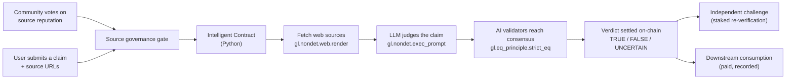

# ClaimGuard

An on-chain fact-checking oracle built on GenLayer.

ClaimGuard lets anyone submit a natural-language claim plus web sources. An
Intelligent Contract fetches the sources, asks an LLM to judge the claim, and
settles a TRUE / FALSE / UNCERTAIN verdict through multi-validator AI consensus
(the equivalence principle).

Beyond basic fact-checking, ClaimGuard adds three safeguards that make settled
verdicts trustworthy and consequential:

1. **Transparent source governance** - every source domain has an on-chain
   reputation, built from community up/down votes (one vote per address). A
   claim is rejected if any of its sources has a negative reputation.
2. **Challenge path** - an independent party can contest a settled verdict by
   staking value. The contract re-runs verification against the original
   sources plus the challenger's counter-evidence. A corrected verdict rewards
   the challenger; an upheld verdict forfeits their stake to the claim owner.
3. **Consequential consumption** - downstream parties pay a fee to consume a
   settled verdict, and every consumption is recorded on-chain. Fees flow to
   the claim owner, creating a market for verified truth.

## The flow at a glance



In plain words:

1. The community votes source domains up or down, building an on-chain
   reputation for each domain.
2. You type a claim (for example "Ethereum moved to proof-of-stake in 2022")
   and paste a few links as evidence. The contract rejects the claim if any
   source has a negative reputation.
3. The contract itself opens those links and reads the pages.
4. The contract asks an AI to judge: is the claim TRUE, FALSE, or UNCERTAIN?
5. Several AI validators run the same check and must agree. Only then is the
   verdict written to the blockchain, along with a confidence score and a short
   reasoning sentence.
6. Any independent party can contest the verdict by staking value, and any
   downstream party can consume the settled verdict by paying a fee.

## Why GenLayer

Normal smart contracts cannot read the web or make judgment calls. GenLayer's
Intelligent Contracts can fetch live web data, process unstructured text with an
LLM, and settle subjective outcomes on-chain through decentralized AI
validators. ClaimGuard is a minimal demonstration of that core primitive:
judgment on unstructured data, settled on-chain.

## The core contract

The fact-checking engine rests on three GenLayer superpowers, used in a single
method:

```python
def _analyze(self, claim_text: str, source_urls: str) -> dict:
    def get_verdict() -> str:
        gathered = ""
        for url in source_urls.split("\n"):
            # 1. Internet access: the contract reads a real web page
            page = gl.nondet.web.render(url, mode="text")
            gathered += "=== SOURCE: " + url + " ===\n" + page + "\n\n"

        # 2. AI: the contract asks an LLM to judge the claim
        result = gl.nondet.exec_prompt(task, response_format="json")
        return json.dumps(result, sort_keys=True)

    # 3. Consensus: multiple validators must produce the same verdict
    return json.loads(gl.eq_principle.strict_eq(get_verdict))
```

| GenLayer primitive | What it does |
| --- | --- |
| `gl.nondet.web.render(url)` | Gives the contract internet access |
| `gl.nondet.exec_prompt(task)` | Lets the contract call an LLM |
| `gl.eq_principle.strict_eq(fn)` | Forces AI validators to agree before committing |

## How it works

**Source governance**

1. `vote_source(domain, reliable)` - vote a source domain up or down (one vote
   per address, switching allowed)
2. `get_source(domain)` - read a domain's up votes, down votes and net
   reputation

**Claim lifecycle**

1. `submit_claim(claim_text, source_urls)` - record a claim and its sources
   (rejected if any source has negative reputation)
2. `verify_claim(claim_id)` - fetch the sources, run the LLM, settle a verdict
3. `get_claims()` / `get_claim_count()` - read the on-chain ledger

**Challenge path**

1. `challenge_claim(claim_id, counter_evidence)` - stake value to contest a
   settled verdict; re-runs verification with the counter-evidence included.
   A changed verdict is `overturned` (challenger rewarded); an unchanged
   verdict is `upheld` (stake forfeited to the owner).
2. `get_challenges()` - audit the challenge record

**Consequential consumption**

1. `consume_verdict(claim_id)` - pay a fee to consume a settled verdict; the
   fee is credited to the claim owner and the consumer is recorded.
2. `get_consumers(claim_id)` - who consumed a given verdict
3. `get_escrow(address)` - claimable balance accrued from fees and forfeited
   stakes

A verdict is one of `TRUE`, `FALSE`, or `UNCERTAIN`, with a `confidence`
(0-100) and a short `reasoning` sentence.

## Architecture

```
contracts/claim_guard.py   # the Intelligent Contract (Python)
tests/direct/              # fast in-memory tests (web + LLM mocked)
frontend/                  # Next.js 15 app (TypeScript, TanStack Query, Radix UI)
deploy/                    # deployment script
```

## Quick start

Python 3.12+ is required.

```bash
# lint the contract
genvm-lint check contracts/claim_guard.py

# direct mode tests (no Studio required)
pytest tests/direct/ -v

# deploy (requires GenLayer Studio or testnet)
genlayer deploy

# run the frontend
cd frontend && npm install && npm run dev
```

## Contract API

| Method | Kind | Description |
| --- | --- | --- |
| `vote_source(domain, reliable)` | write | Vote a source domain up or down (one vote per address) |
| `get_source(domain)` | view | Read a source domain's reputation |
| `submit_claim(text, urls)` | write | Record a claim (rejected if a source has negative reputation) |
| `verify_claim(id)` | write | Fetch sources and settle a verdict via AI consensus |
| `challenge_claim(id, evidence)` | write (payable) | Stake to contest a settled verdict |
| `consume_verdict(id)` | write (payable) | Pay a fee to consume a settled verdict |
| `get_claims()` | view | All claims, grouped by owner |
| `get_claim_count()` | view | Total number of claims submitted |
| `get_challenges()` | view | Audit trail of challenges |
| `get_consumers(id)` | view | Consumers of a given verdict |
| `get_escrow(address)` | view | Claimable balance from fees and forfeited stakes |

## License

MIT
