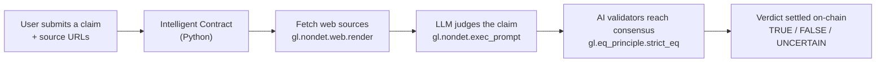

# ClaimGuard

An on-chain fact-checking oracle built on GenLayer.

ClaimGuard lets anyone submit a natural-language claim plus web sources. An
Intelligent Contract fetches the sources, asks an LLM to judge the claim, and
settles a TRUE / FALSE / UNCERTAIN verdict through multi-validator AI consensus
(the equivalence principle).

## The flow at a glance



In plain words:

1. You type a claim (for example "Ethereum moved to proof-of-stake in 2022")
   and paste a few links as evidence.
2. The contract itself opens those links and reads the pages.
3. The contract asks an AI to judge: is the claim TRUE, FALSE, or UNCERTAIN?
4. Several AI validators run the same check and must agree. Only then is the
   verdict written to the blockchain, along with a confidence score and a short
   reasoning sentence.

## Why GenLayer

Normal smart contracts cannot read the web or make judgment calls. GenLayer's
Intelligent Contracts can fetch live web data, process unstructured text with an
LLM, and settle subjective outcomes on-chain through decentralized AI
validators. ClaimGuard is a minimal demonstration of that core primitive:
judgment on unstructured data, settled on-chain.

## The core contract

The whole project rests on three GenLayer superpowers, used in a single method:

```python
def _analyze(self, claim_text: str, source_urls: str) -> dict:
    def get_verdict() -> str:
        gathered = ""
        for url in source_urls.split("\n"):
            # 1. Internet access: the contract reads a real web page
            page = gl.nondet.web.render(url, mode="text")
            gathered += "=== SOURCE: " + url + " ===\n" + page + "\n\n"

        # 2. AI: the contract asks an LLM to judge the claim
        result = gl.nondet.exec_prompt(task, response_format="json")
        return json.dumps(result, sort_keys=True)

    # 3. Consensus: multiple validators must produce the same verdict
    return json.loads(gl.eq_principle.strict_eq(get_verdict))
```

| GenLayer primitive | What it does |
| --- | --- |
| `gl.nondet.web.render(url)` | Gives the contract internet access |
| `gl.nondet.exec_prompt(task)` | Lets the contract call an LLM |
| `gl.eq_principle.strict_eq(fn)` | Forces AI validators to agree before committing |

## How it works

1. `submit_claim(claim_text, source_urls)` - record a claim and its sources
2. `verify_claim(claim_id)` - fetch the sources, run the LLM, settle a verdict
3. `get_claims()` / `get_claim_count()` - read the on-chain ledger

A verdict is one of `TRUE`, `FALSE`, or `UNCERTAIN`, with a `confidence`
(0-100) and a short `reasoning` sentence.

## Architecture

```
contracts/claim_guard.py   # the Intelligent Contract (Python)
tests/direct/              # fast in-memory tests (web + LLM mocked)
frontend/                  # Next.js 15 app (TypeScript, TanStack Query, Radix UI)
deploy/                    # deployment script
```

## Quick start

Python 3.12+ is required.

```bash
# lint the contract
genvm-lint check contracts/claim_guard.py

# direct mode tests (no Studio required)
pytest tests/direct/ -v

# deploy (requires GenLayer Studio or testnet)
genlayer deploy

# run the frontend
cd frontend && npm install && npm run dev
```

## Contract API

| Method | Kind | Description |
| --- | --- | --- |
| `submit_claim(text, urls)` | write | Record a claim (text + newline-separated source URLs) |
| `verify_claim(id)` | write | Fetch sources and settle a verdict via AI consensus |
| `get_claims()` | view | All claims, grouped by owner |
| `get_claim_count()` | view | Total number of claims submitted |

## License

MIT
