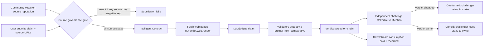

# Architecture

How ClaimGuard actually works under the hood. This is the deep dive - if you
want a one-paragraph summary, read the [README](../README.md) instead.

## What the contract does

ClaimGuard is a single Intelligent Contract (`contracts/claim_guard.py`) that
settles verdicts on natural-language claims. Anyone can:

1. Vote a source domain up or down (community-driven reputation)
2. Submit a claim plus one or more source URLs
3. Run AI consensus to fetch sources and judge the claim TRUE / FALSE / UNCERTAIN
4. Challenge a settled verdict by staking value
5. Consume a settled verdict by paying a fee

The contract is one Python file, around 350 lines, no external dependencies
beyond the GenLayer SDK.

## Storage layout

The contract uses four flat `TreeMap[str, str]` slots plus four typed slots.
The flat layout is intentional: nested generics (`TreeMap[str, TreeMap[...]]`)
break the GenLayer Studio schema parser with "Could not load contract schema",
so we flatten by encoding values as JSON and composing keys.

### Composite keys

| Storage | Key format | Value format |
| --- | --- | --- |
| `claims` | `"<owner_hex>:<claim_id>"` | JSON-encoded `Claim` dataclass |
| `votes` | `"<domain>:<voter_hex>"` | `"up"` or `"down"` |
| `escrow` | `"<addr_hex>"` | Decimal balance as string |
| `consumers` | `"<claim_id>"` | JSON array of consumer addresses |
| `sources` | `<domain>` | `Source` dataclass (typed) |
| `challenges` | `<challenge_id>` | `Challenge` dataclass (typed) |

Composite keys let us iterate or scan by suffix when we need to find a claim
by id across owners. `_find_claim` walks `self.claims.keys()` and matches the
`:claim_id` suffix.

Case sensitivity rules (important, easy to get wrong):

- The owner portion of the claim key is preserved exactly as `Address.as_hex`
  produces (EIP-55 checksummed). Lookups must use the same case.
- The voter portion of the vote key is lowercased (`voter.as_hex.lower()`).
- The domain portion of the vote key is also lowercased, so reputation is
  case-insensitive on the domain side (`example.com` == `EXAMPLE.com`).

If you mix up case on the owner side, tests will mysteriously fail with
"Claim not found" because the key never matches.

### JSON encoding for claims

Claims are stored as JSON strings rather than as direct dataclass instances
because GenLayer's `gl.allow_storage` decorator cannot wrap a `@dataclass`
that itself contains lists or dicts. The workaround:

```python
def _serialize_claim(c) -> str:
    if hasattr(c, "__dataclass_fields__"):
        return json.dumps(asdict(c), sort_keys=True)
    return json.dumps(c, sort_keys=True)
```

We use `sort_keys=True` so two semantically equal claims produce byte-identical
JSON. This matters when validators compare claim snapshots during consensus.

### Why not nested TreeMaps?

The current GenLayer Studio schema parser rejects nested generics with a
generic "Could not load contract schema" error. The pattern that works is:

```python
# WORKS - flat with JSON values
storage: TreeMap[str, str]   # key -> json.dumps(value)

# DOES NOT WORK - nested generics
storage: TreeMap[str, TreeMap[str, str]]   # parser rejects
```

This is the same workaround used for the `consumers` map (one claim id, one
JSON list of consumer addresses).

## State machine: claim lifecycle

```
                submit_claim
                     |
                     v
            +------------------+
            |    PENDING       |  has_resolved = False
            +------------------+
                     |
                     | verify_claim (LLM consensus)
                     v
            +------------------+
            |    VERIFIED      |  has_resolved = True
            +------------------+
                     |
        +------------+------------+
        |                         |
        | challenge_claim         | consume_verdict
        v                         v
    +-----------+         +----------------+
    | CHALLENGED|         |   CONSUMED     |
    +-----------+         +----------------+
        |
        +-- verdict changed -> OVERTHROWN (challenger wins stake * 2)
        +-- verdict same    -> UPHELD (challenger loses stake to owner)
```

A claim can be challenged at most once. We track that with `challenge_status`:

- `"none"` - freshly verified, eligible for challenge
- `"overturned"` - challenge succeeded, verdict was corrected
- `"upheld"` - challenge failed, verdict unchanged

## Consensus: why prompt_non_comparative (not strict_eq)

This is the single most important architectural decision. GenLayer gives you
two equivalence strategies:

1. `gl.eq_principle.strict_eq(fn)` - all validators must produce byte-identical
   output. Pass = unanimous.
2. `gl.eq_principle.prompt_non_comparative(fn, task, criteria)` - leader proposes
   an answer, validators judge it against written criteria. Pass if validators
   accept the proposal.

For LLM-backed calls, `strict_eq` is wrong. LLM outputs are non-deterministic
(even at temperature 0 they vary subtly across models, providers, and runs).
With `strict_eq` validators can never reach byte-perfect consensus and the
transaction reverts with `Undetermined`.

`prompt_non_comparative` sidesteps this by letting validators make a judgment
call against explicit criteria. The criteria we use:

- Response is valid JSON with exactly three fields: `verdict`, `confidence`,
  `reasoning`.
- `verdict` is uppercase `TRUE`, `FALSE`, or `UNCERTAIN` only.
- `confidence` is an integer between 0 and 100.
- `reasoning` is one short sentence.
- The verdict must be justified by the cited web evidence. If evidence does
  not support or contradict the claim, verdict must be `UNCERTAIN`.
- The verdict must NOT be invented or unsupported.

This shifts consensus from "do we produce identical strings?" to "do we agree
the answer is justified?". Much more robust for LLM-backed workflows.

The cost is that you have to think carefully about your criteria - they
encode what validators should and should not accept.

## Source governance mechanics

Every source domain has an on-chain reputation built from community votes.
The flow:

1. Anyone can call `vote_source(domain, reliable)`.
2. The contract stores one vote per `(domain, voter)` address. A voter can
   switch their vote (up to down, down to up); the old vote is undone before
   the new vote is applied.
3. Reputation is `up_votes - down_votes` (integer, can go negative).
4. When a claim is submitted, every source URL is reduced to its domain and
   checked: if `reputation < MIN_REPUTATION` (currently 0), the submission
   is rejected.

This is intentionally minimal. There is no:

- Vote delegation or weight
- Time decay on old votes
- Penalty for switching votes frequently
- Sybil resistance (one address = one vote, but nothing prevents one person
  from controlling many addresses)

See [LIMITATIONS.md](LIMITATIONS.md) for a full accounting.

## Escrow accounting

Three flows credit an address's escrow balance:

1. `consume_verdict` - caller pays CONSUME_FEE (1 unit), which credits the
   claim owner.
2. `challenge_claim` won (verdict changed) - challenger is refunded their
   stake plus an equal reward (stake * 2 total).
3. `challenge_claim` lost (verdict unchanged) - stake is forfeited to the
   claim owner.

The escrow is tracked separately from the message value. We do not transfer
native value, only record amounts owed. To actually withdraw, an off-chain
script or follow-up method (currently absent) would need to be added.

In practice this means the contract is a demo of accounting, not a
production token economy. See [SECURITY.md](SECURITY.md) and
[LIMITATIONS.md](LIMITATIONS.md).

## Flow at a glance



## File map

| File | Role |
| --- | --- |
| `contracts/claim_guard.py` | The Intelligent Contract (Python) |
| `contracts/PatternTest.py` | Sandbox contract for testing GenLayer patterns |
| `tests/direct/test_claim_guard.py` | Behavioural tests for the contract |
| `tests/direct/test_claim_guard_unit.py` | Unit tests for edge cases that don't need LLM mock |
| `tests/direct/test_patterns.py` | Tests for individual GenLayer patterns |
| `tests/direct/conftest.py` | Shared helpers (address hex conversion) |
| `frontend/lib/contracts/ClaimGuard.ts` | TypeScript SDK wrapper |
| `frontend/lib/hooks/useClaimGuard.ts` | React Query hooks |
| `frontend/app/` | Next.js pages |
| `deploy/deployScript.ts` | One-shot deploy script |
| `config/genlayer_config.py` | Local RPC config loader |

## What we would change next

A non-exhaustive wishlist:

- Replace JSON-encoded claims with a properly typed storage pattern once the
  Studio schema parser supports nested generics.
- Add a `withdraw_escrow` method so the on-chain accounting actually moves
  value out of the contract.
- Calibrate confidence scores against historical accuracy, not raw LLM output.
- Support batched verification (verify N claims in one LLM call).
- Add an appeals process: if a challenge is upheld, allow one more challenge
  with higher stake.
- Make source reputation time-decayed (older votes count less).
